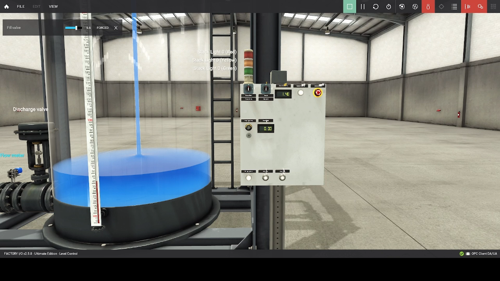

# Tank Level Control System for Oil and Gas Processing 

This project simulates a simplified version of an offshore tank level management system using Factory IO and CODESYS. While the simulation uses water, the control logic, alarm systems, and automation principles are directly applicable to oil, chemical, or produced water tanks typically found on offshore platforms and Oil and Gas processing facilities. The focus here is safe, precise control of fluid levels. 

## System Overview

The Factory IO scene is made up of, level sensors to monitor fluid, a PID controller and automated valves with a simple control panel, that takes in operator input. The project assumes a continous flow from an upstream source.  
Components of the project include: 

- A tank with high and low-level sensors.
- Inlet and outlet valves for precise flow control.
- A PID controller to maintain a stable setpoint.
- Manual/Automatic process selection
- Emergancy control button
- Visual Alarm components

## Technical Implementation

The project was progragmmed in CodeSys, using both Ladder Logic and Structured Text components. The ladder logic generally handles the main process control, and Function blocks used within the main flow, use Structure Text, mainly the PID Controller that handles flow regulation. 

**Alarms**: High and low-level alerts to prevent spills or equipment damage, critical for safety compliance.

**Auto-Drain**: Drains the tank to a setpoint automatically, optimizing throughput like in a produced water system.

**Manual Override**: Lets operators take control in emergencies, a key feature on rigs.

**PID Control**: Smoothly adjusts flow to keep levels stable, mirroring real-world process optimization.

#### PID Oscillator MP4 example

## Code and Scene Details

I’ve included the Factory IO scene setup and CodeSys code in the repository to show exactly how this system comes together.

The scene makes use of the tank component, details can be found [here](https://docs.factoryio.com/manual/parts/stations/#tank)

You can find the scene configuration in ./src/factory_io/tank_scene_description.txt, which details the setup. (Note: The .fio file is proprietary, so I’ve documented the components and settings for clarity.) Check out the screenshot in ./media/tank_scene.png to see it in action.

CodeSys Code
The CodeSys project uses ladder logic and structured text to bring the system to life, mimicking PLC programming in oil and gas automation. 

The CodeSys project can be found in the following folder: `./src/codesys/`

Connection between Factory IO and CodeSys is done via the OPC UA protocol. The connection is established using the Factory IO OPC UA server, which allows CodeSys to read and write data to and from Factory IO.

### Limitations of Factory IO

Factory IO is great for prototyping, but its got its limits. The only liqud avliable for the tank component is water, and not a other fluids such as oil and gas. Secondly the components related to the Oil and Gas field are limited, as components are generally built around Factory automation and processing.

At the time of writing, I wasn't able to get my hands on an PLC to implement the control logic with and I choose to simluate the PLC with CodeSys. 

### Future Improvements
I’m excited to take this further! Next steps include adding a SCADA-style dashboard to visualize trends, and display real-time data to make fast, safe decisions. Simulating sensor failures or multiphase fluids would also make it even more realistic.

### Let’s Connect!
This project blends my software engineering expertise with my interest in oil and gas automation, and I'd would be interested in hearing your thoughts on the project. 
