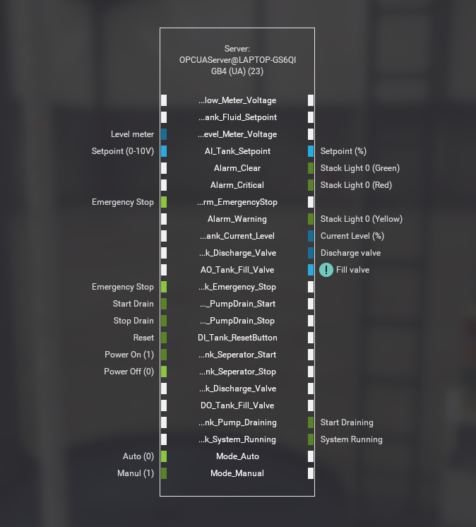

## Tank Level Control Scene Description (Factory IO)

This document describes the Factory IO scene used in the Tank Level Control System project, designed to simulate a produced water treatment unit in an oil and gas facility.

Scene Components:

- Tank: (representing a separator or holding tank)
- Level Sensors:
  - High-level sensor
  - Low-level sensor

Control Panel is made up of the following components:

- Circuit Box & Stand
- Selector (ON/OFF)
- Display Light (System Running)
- Selector (Auto/Manual)
- Emergancy Stop Button
- Tank level Display (0-10V)
- Setpoint level Display (0-10V)
- Manual Push button (Start)
- Manual Push button (Stop)
- Display Light (Manual Drain)

Example OPC Server Mapping

Exposed variables can be found [here](../codesys/).

OPC Server setup details can be found [here](https://docs.factoryio.com/manual/drivers/opc/)
